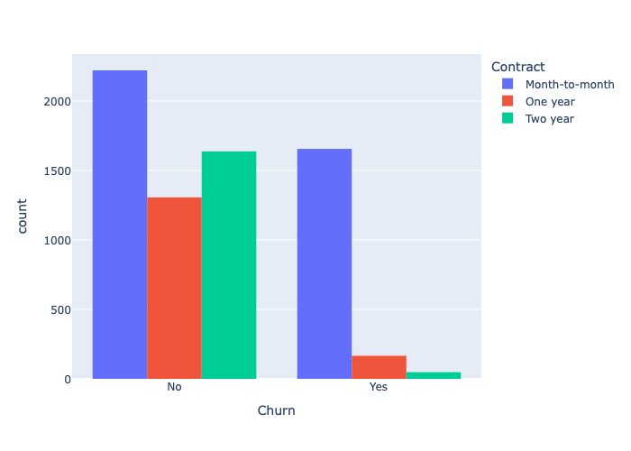
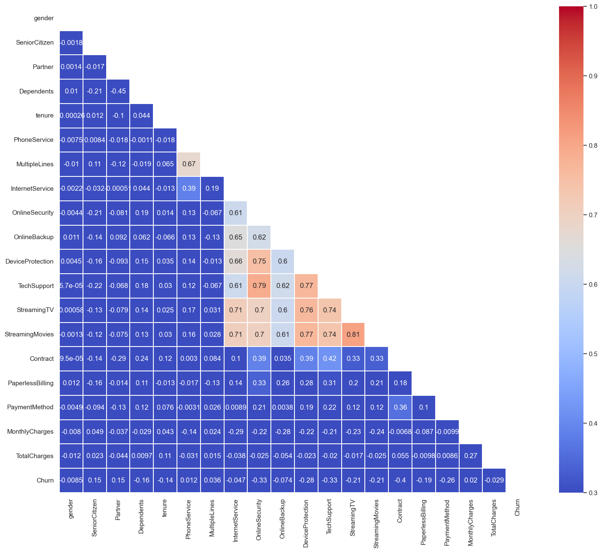

# Customer Churn Prediction 

## 1. Introduction
Customer churn prediction is a crucial aspect of business intelligence, helping companies identify customers who are likely to stop using their services or products. By leveraging machine learning and predictive analytics, businesses analyze customer behavior, transaction history, engagement levels, and other key indicators to forecast churn. Big companies, including telecom giants, e-commerce platforms, and subscription-based services, rely heavily on churn prediction to enhance customer retention strategies. For instance, Netflix and Amazon Prime use advanced models to detect users at risk of unsubscribing and offer personalized recommendations or discounts to retain them. Similarly, telecom companies like AT&T and Verizon analyze usage patterns to prevent customers from switching to competitors. Churn prediction is vital because retaining existing customers is significantly more cost-effective than acquiring new ones. A well-implemented churn prediction system helps businesses proactively address customer concerns, improve satisfaction, and ultimately boost long-term revenue.

### Importance of Churn Prediction
- **Revenue Retention**: Helps prevent revenue loss by identifying at-risk customers.
- **Customer Relationship Management**: Enables personalized engagement strategies to improve satisfaction.
- **Cost Optimization**: Retaining existing customers is more cost-effective than acquiring new ones.
- **Strategic Decision-Making**: Businesses can adjust their marketing and customer service strategies based on churn risk insights.

### Applications in Business
- **Telecom Companies**: Predict customer dissatisfaction and prevent service cancellations.
- **Banking & Financial Services**: Identify clients likely to close accounts or switch to competitors.
- **E-commerce & Retail**: Forecast subscription cancellations and optimize loyalty programs.
- **SaaS & Subscription-Based Services**: Minimize customer attrition by enhancing engagement.
- **Healthcare & Insurance**: Improve patient and policyholder retention strategies.

## 2. Data Analytics Process
### Dataset Overview
The dataset consists of the following key features:
- **Demographics**: Gender, Senior Citizen, Partner, Dependents
- **Account Details**: Tenure, Contract type, Payment Method, Paperless Billing
- **Service Usage**: Internet Service, Online Security, Tech Support, Streaming TV & Movies
- **Financial Information**: Monthly Charges, Total Charges
- **Target Variable**: Churn (Yes/No)

### Insights from Visualizations
1. **Churn Distribution by Gender**
   - The donut chart shows the distribution of churn across male and female customers.
   - The churn rate appears to be relatively balanced across genders, indicating that gender alone may not be a strong predictor of churn.
   

2. **Distribution of Monthly Charges by Churn**
   - The KDE plot indicates that customers with lower monthly charges have a lower churn rate, while those with mid-range to high monthly charges exhibit higher churn.
   - Customers in the range of $60 to $100 monthly charges have a higher churn tendency.
   

4. **Feature Correlation with Churn**
   - Tenure is negatively correlated with churn, meaning longer-tenured customers are less likely to churn.
   - Monthly charges and paperless billing are positively correlated with churn, indicating that higher monthly bills and digital invoicing may be factors in customer dissatisfaction.
   - Dependents and partners show negative correlations, suggesting customers with family commitments may be more loyal.
  

## 3. Exploratory Data Analysis (EDA) and Feature Engineering
### EDA Techniques Applied
- **Data Cleaning**: Handling missing values, removing duplicates, and correcting data types.
- **Statistical Summaries**: Analyzing distributions of numerical and categorical variables.
- **Correlation Analysis**: Identifying relationships between different features.
- **Data Visualization**: Using histograms, box plots, and heatmaps to gain insights.
- **Class Imbalance Analysis**: Checking the distribution of churn vs. non-churn customers.

### Feature Engineering
- **Encoding Categorical Variables**: Transforming non-numeric data into numerical format.
- **Feature Scaling**: Normalizing continuous features to improve model performance.
- **New Feature Creation**: Derived metrics that provide additional insights into customer behavior.
- **Dimensionality Reduction**: Reducing noise in the data to improve efficiency.

## 4. Predictive Modeling
### Models Used
- **Logistic Regression**: A simple yet effective baseline model.
- **Support Vector Classifier (SVC)**: Captures complex decision boundaries.
- **K-Nearest Neighbors (KNN)**: A distance-based approach.
- **Random Forest**: An ensemble approach improving decision tree performance.
- **Gradient Boosting (XGBoost, LightGBM)**: Advanced boosting techniques to enhance predictive accuracy.
- **Adaboost**: An ensemble learning technique improving weak classifiers.
- **Voting Classifier**: A combination of multiple models to improve performance.

### Model Performance and Selection
Each model was evaluated using standard performance metrics:
- **Accuracy**: Measures overall correctness.
- **Precision & Recall**: Evaluates model effectiveness for churn detection.
- **F1 Score**: Balances precision and recall.
- **ROC-AUC Score**: Assesses the model’s ability to distinguish between churn and non-churn.

### Best Performing Models
1. **Adaboost**: Achieved the highest accuracy (84.45%) making it the top-performing model.
2. **Voting Classifier**: Close performance to Adaboost high accuracy .
3. **Gradient Boosting**: Performed well with a balanced accuracy and F1-score, making it a strong choice for prediction.

The best-performing model was selected based on the highest F1-score and AUC-ROC values, ensuring optimal predictive performance.

